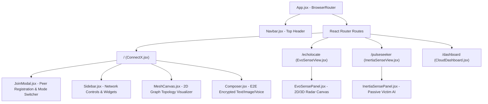

# 🎨 ZoneSync P2P & Disaster Operations Suite — Frontend Layout Guide

> **Architecture, Component Hierarchy, Route Mapping, and UI Enhancement Guide**

This document details the complete frontend layout, component structure, design system tokens, and page workflows for **ZoneSync P2P v3.0**. Use this guide to easily navigate, customize, and enhance the user interface.

---

## 📐 1. Component Hierarchy & Route Map



---

## 🖼️ 2. Detailed Page Layouts & Component Specifications

### 🌐 Page 1: ConnectX (`/`)
*Primary serverless P2P messaging interface and distributed network graph visualizer.*

#### Components:
1. **`Navbar.jsx`**:
   - **Left**: Brand logo (`⚡ ZoneSync`).
   - **Right**: Navigation tabs (`🌐 ConnectX`, `📡 EvoSense`, `⚡ InertiaSense`, `☁️ Cloud Dashboard`).
2. **`JoinModal.jsx`**:
   - Initial modal dialog requesting Device Display Name and operational mode selector. Automatically generates a unique peer ID.
3. **`MeshCanvas.jsx`**:
   - **HTML5 Canvas** rendering real-time network topology:
     - Nodes displayed as glowing circular avatars with name labels.
     - Direct WebRTC data links rendered with RTT latency labels (ms).
     - Link colors indicate congestion state: Green (Normal), Amber (`watch`), Red (`congested`).
     - Animated pulse effects along hops when routing messages via Dijkstra's algorithm.
4. **`Composer.jsx`**:
   - Input text field with real-time **On-Device AI Urgency Badge** preview (`CRITICAL`, `ELEVATED`, `NORMAL`).
   - Media buttons:
     - `🖼️ Image`: Client-side JPEG compression & ~12KB chunking.
     - `🎤 Voice Note`: Micro-recording using Opus `MediaRecorder` audio.
     - `📍 Share Location With Everyone`: One-click GPS location broadcast.
5. **`Sidebar.jsx`**:
   - **Security Card**: Displays `🔒 End-to-End Encryption — Active` badge & ECDH public key fingerprint.
   - **Location Card**: Opt-in continuous GPS location sharing & manual coordinate fallback.
   - **Cloud Sync**: Toggle background telemetry sync to port 4002.
   - **Quick Shortcuts**: Navigation cards for EvoSense and InertiaSense.
   - **Simulation Tool**: `⚠ Simulate Failure` button to simulate node drops and test self-healing Dijkstra rerouting.

---

### 📡 Page 2: EvoSense Radar Map (`/echolocate` or `/evosense`)
*Acoustic-only 2D/3D indoor positioning system canvas without GPS or WiFi RSSI.*

#### Components:
1. **`EvoSensePanel.jsx`**:
   - **2D/3D Radar Canvas**:
     - Polar scale rings (5m, 10m, 15m, 20m).
     - Pairwise distance vectors connecting detected devices.
     - Grid coordinates for relative positioning $(x, y)$.
     - 3D interactive orbit and perspective projection.
   - **Control Header**:
     - Chirp Sweep Select (17–19 kHz LFM sweep).
     - Action Buttons: `🔊 Play Test Chirp`, `⚡ Simulate Demo Plot` (forces instant visual plot for demonstration on non-mic environments).
     - Microphone UX indicator badge.

---

### ⚡ Page 3: InertiaSense Rescue Dashboard (`/pulseseeker` or `/inertiasense`)
*AI-powered passive victim detection system for trapped or unconscious survivors.*

#### Components:
1. **`InertiaSensePanel.jsx`**:
   - **Status Header**: Active detection badges, environmental status tag (`basement`, `rooftop`, `collapsed-structure`).
   - **Disaster Simulation Suite**:
     - `🔨 Simulate Tapping (3.2 Hz)`: Simulates periodic wall/pipe tapping.
     - `🛌 Simulate Inertia (>5m Stillness)`: Simulates unconscious victim motionlessness.
     - `🚨 Trigger Auto-Beacon Broadcast`: Tests P2P mesh beacon dispatch.
   - **Telemetry View Tab**:
     - **Rhythmic Tapping Card**: Percentage confidence meter (0–100%).
     - **Inertia Timer Card**: Motionlessness duration counter (seconds/minutes).
     - **Environmental Card**: Damping and acoustic proxy classifier.
     - **Acoustic Spectrum Bars**: 25-dimensional sub-band energy visualizer.
   - **Survivor Beacons Feed Tab**:
     - Real-time list of auto-generated survivor alerts with confidence %, GPS coordinates, and timestamp.

---

### ☁️ Page 4: Remote Cloud Dashboard (`/dashboard`)
*Remote command center ops view for monitoring offline mesh statistics and updating AI models.*

#### Components:
1. **`CloudDashboard.jsx`**:
   - Aggregate statistics across all reporting mesh nodes.
   - Live AI Keyword Model Retraining & Deployment Form (`Word` + `Weight` -> `Deploy Model`).
   - Node activity timeline.

---

## 🎨 3. CSS Design Tokens & Theme System (`src/index.css`)

The application uses custom Vanilla CSS design tokens for maximum flexibility and performance:

```css
:root {
  --bg: #0A0D14;                  /* Main background dark hue */
  --panel: rgba(18, 24, 38, 0.75);/* Glassmorphic card panels */
  --panel-solid: #121826;         /* Solid panel fallback */
  --glass-border: rgba(255, 255, 255, 0.08); /* Card border lines */
  --line: rgba(255, 255, 255, 0.12);
  --text: #F0F4FC;                /* Primary text color */
  --muted: #8E9BB0;               /* Subtitle / secondary text */
  --blur: blur(12px);             /* Glassmorphism blur filter */
  
  /* Status Colors */
  --accent: #33D6A6;              /* Green - Normal / Online */
  --danger: #FF4B5C;              /* Red - Critical / Emergency */
  --warning: #F0A63C;             /* Amber - Elevated / Watch */
  --info: #529CFF;                /* Blue - Information */
  
  /* Fonts */
  --font-sans: 'Inter', -apple-system, sans-serif;
  --mono: 'IBM Plex Mono', monospace;
  --radius: 12px;
}
```

---

## 🚀 4. How to Enhance & Extend the UI

Here are ideas and guidelines for extending the frontend:

1. **Light / Dark Mode Toggle**:
   - Add a theme switcher in `Navbar.jsx` that updates CSS variables on `document.documentElement.setAttribute('data-theme', 'light')`.
2. **3D Mesh Topology Map**:
   - Upgrade `MeshCanvas.jsx` using `Three.js` or `React Three Fiber` for a 3D globe or spatial node network.
3. **Interactive Map Tiles**:
   - Embed `Leaflet.js` or `Mapbox GL` inside `InertiaSensePanel.jsx` to show survivor pin markers on real GIS satellite maps.
4. **Sound Alerts for Critical SOS**:
   - Use Web Audio API inside `ConnectX.jsx` to play an alarm tone when a `critical` priority message is received.
