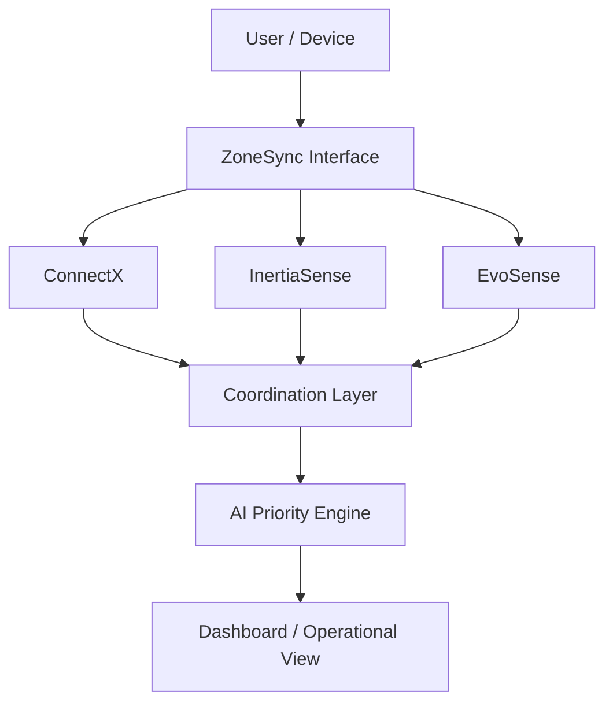

# 🌐 ZoneSync
> **Connect · Sense · Locate · Prioritize** — An Intelligent Indoor Operations & Coordination Platform

---

## 📌 Table of Contents
1. [Overview: What is Happening?](#-1-overview-what-is-happening)
2. [Key Features & System Architecture](#-2-key-features--system-architecture)
3. [Technologies & Architecture Used](#-3-technologies--architecture-used)
4. [How It Works: Deep-Dive Technical Mechanics](#-4-how-it-works-deep-dive-technical-mechanics)
5. [Complete Command Reference](#-5-complete-command-reference)
6. [Step-by-Step Demo Guide](#-6-step-by-step-demo-guide)
7. [API & Endpoint Reference](#-7-api--endpoint-reference)
8. [Limitations & Production Roadmap](#-8-limitations--production-roadmap)

---

## 🏢 1. Overview: What is Happening?

In large or complex indoor environments—such as **university campuses, industrial warehouses, exhibition venues, multi-story corporate facilities, and transport hubs**—traditional communication and positioning infrastructure encounters severe operational challenges:
1. **Connectivity Dead Zones**: Basements, metal-clad facilities, and dense structural walls frequently cause Wi-Fi drops and cellular blackouts.
2. **GPS Blind Spots**: Satellite positioning cannot penetrate concrete ceilings or multi-tier floors to provide indoor location awareness.
3. **Information Overload & Triage**: Operators need immediate, automated prioritization when personnel require assistance or operational anomalies occur.

### What ZoneSync Does
ZoneSync transforms standard smartphones, tablets, and laptops into a **self-healing, zero-install, decentralized indoor coordination platform**.
- **ConnectX**: Devices discover each other locally and establish **serverless WebRTC peer-to-peer data channels** to route messages, telemetry, voice notes, and media hop-by-hop.
- **InertiaSense**: Employs on-device acoustic and motion monitoring to automatically recognize activity patterns and flag prolonged inactivity.
- **EvoSense**: Calculates relative indoor spatial positions using ultrasonic acoustic chirps and multilateration without requiring GPS or external beacons.
- **AI Priority Engine**: Analyzes real-time text, voice, and sensor signals locally to classify and triage events into intelligent priority streams.
- **Coordination Dashboard**: Delivers a unified operational overview of connected devices, active zones, spatial coordinates, and prioritized alerts.

```
ConnectX              InertiaSense              EvoSense
   ↓                       ↓                       ↓
Communication      Activity Awareness      Spatial Awareness
   └───────────────────────┬───────────────────────┘
                           ↓
                   AI Priority Engine
                           ↓
                     Prioritization
                           ↓
                 Coordination Dashboard
                 (Operator / User View)
```

---

## ✨ 2. Key Features & System Architecture

### Key Capabilities

| Feature | Description | Status |
|---|---|---|
| 📡 **ConnectX** | Decentralized, local peer-to-peer device communication and multi-hop routing using Dijkstra shortest-path algorithms over WebRTC data channels. | ✅ Implemented |
| 📍 **EvoSense** | Indoor spatial sensing and acoustic positioning canvas that calculates relative coordinates using ultrasonic LFM chirps and multilateration. | ✅ Implemented |
| 📊 **InertiaSense** | Activity and unusual inactivity detection layer utilizing device motion and acoustic feature analysis to detect anomalies. | ✅ Implemented |
| 🤖 **AI Priority Engine** | In-browser NLP urgency classification that tags messages and events (`CRITICAL`, `ELEVATED`, `NORMAL`) locally without cloud dependencies. | ✅ Implemented |
| 📱 **Coordination Dashboard** | Central operational interface providing live visibility into connected nodes, dynamic network topology, spatial maps, and priority streams. | ✅ Implemented |
| 🔒 **End-to-End Encryption (E2EE)** | On-device ECDH (P-256) key exchange + AES-256-GCM payload encryption + ECDSA digital signatures for tamper-proof coordination. | ✅ Implemented |
| 🎤 **Encrypted Voice Notes** | In-browser audio recording (Opus/AAC/MP4) with automatic chunking, mesh transmission, and inline playback. | ✅ Implemented |
| 🖼️ **Encrypted Image Transmission** | Dynamic canvas-based image downsampling and sequential chunked transfer across the P2P mesh. | ✅ Implemented |
| 📍 **Location Broadcast** | One-click broadcast of indoor coordinates and geospatial references across all mesh peers. | ✅ Implemented |
| ☁️ **Opportunistic Cloud Sync** | Opt-in background telemetry sync and remote AI model distribution when internet access is intermittently available. | ✅ Implemented |

### High-Level Architecture Flowchart



---

## 🛠️ 3. Technologies & Architecture Used

### Frontend & UI
- **React 19 & React Router v7**: Component-driven single-page architecture for fast client-side navigation.
- **Vite 8 (`@vitejs/plugin-react` & `@vitejs/plugin-basic-ssl`)**: Blazing-fast development bundle with automatic HTTPS generation for mobile sensor permissions.
- **HTML5 Canvas 2D**: Real-time rendering of live network topology graph and 360° acoustic radar canvas.
- **Vanilla Modern CSS**: Dark mode tactical interface with glassmorphism, pulse animations, and responsive mobile layouts.

### Networking & P2P Protocols
- **WebRTC (`RTCPeerConnection`, `RTCDataChannel`)**: Serverless, low-latency, bidirectional peer-to-peer data channels between browsers.
- **Socket.io Client & Server (v4.8)**: Ephemeral bootstrap signaling for initial WebRTC SDP offer/answer exchange and ICE candidate negotiation.
- **OSPF-Style Gossip Protocol**: Decentralized link-state advertisement protocol where nodes broadcast local peer lists to build global topology maps.
- **Dijkstra Shortest-Path Routing**: Dynamic graph traversal with congestion-weighted edge costs.

### Cryptography & Security
- **Web Crypto API (`window.crypto.subtle`)**: Hardware-accelerated on-device cryptographic operations.
- **ECDH (Elliptic Curve Diffie-Hellman on P-256 Curve)**: Derives symmetric encryption keys between any two peers without sharing secrets over the wire.
- **AES-256-GCM**: Authenticated symmetric encryption for messages, photos, voice notes, and location coordinates.
- **ECDSA (P-256 with SHA-256)**: Cryptographic signature verification to prevent spoofing, packet tampering, or impersonation.

### Audio & Digital Signal Processing (DSP)
- **Web Audio API (`AudioContext`, `MediaRecorder`, `AudioWorklet`/ScriptProcessor)**: High-resolution audio capture, analysis, and synthesis.
- **Linear Frequency Modulated (LFM) Chirp Synthesis**: Generates 17–19 kHz ultrasonic sweep waveforms for acoustic ranging.
- **Matched-Filter Cross-Correlation**: Time-domain cross-correlation against reference chirp templates for sub-millisecond Time-of-Arrival (ToA) detection.
- **MFCC (Mel-Frequency Cepstral Coefficients) & Spectral Centroids**: 25-dimensional audio feature extraction for tapping rhythm analysis.

### Sensor Telemetry & Mobile APIs
- **`DeviceMotion` & `DeviceOrientation` APIs**: Accelerometer and gyroscopic tracking for fall and unconsciousness detection.
- **HTML5 Geolocation API**: High-accuracy GPS positioning with fallback coordinates.
- **HTML5 FileReader & Canvas Compression**: In-browser image downsampling to optimize packet sizes for mesh transmission.

### Backend Services
- **Node.js & Express 5**: Lightweight, modular backend micro-servers for signaling, cloud telemetry sync, acoustic localization, and lifeboat scoring.

---

## ⚙️ 4. How It Works: Deep-Dive Technical Mechanics

```
                   +---------------------------------------+
                   |       Central Node (Browser)          |
                   |                                       |
                   |  +---------------------------------+  |
                   |  |      UI / Composer / Canvas     |  |
                   |  +----------------+----------------+  |
                   |                   |                   |
                   |  +----------------v----------------+  |
                   |  | On-Device AI Urgency Classifier |  |
                   |  +----------------+----------------+  |
                   |                   |                   |
                   |  +----------------v----------------+  |
                   |  | Web Crypto E2EE (ECDH + ECDSA)  |  |
                   |  +----------------+----------------+  |
                   |                   |                   |
                   |  +----------------v----------------+  |
                   |  | Dijkstra Router & QoS Queues    |  |
                   |  +----------------+----------------+  |
                   |                   |                   |
                   +-------------------+-------------------+
                                       |
                   +-------------------v-------------------+
                   |         WebRTC Data Channels          |
                   |      (Hop-by-Hop P2P Relaying)        |
                   +----+-----------------------------+----+
                        |                             |
                        v                             v
             +--------------------+         +--------------------+
             | Peer B (Relay Node)|         | Peer C (Recipient) |
             | (Opaque Ciphertext)|         | (Decrypted & Acked)|
             +--------------------+         +--------------------+
```

### 1. Serverless P2P Discovery & Routing
1. When a device joins, it connects to `signaling-server.js` (port 4001) for 1–2 seconds to exchange WebRTC SDP offers/answers with 1–2 nearby peers.
2. Once data channels are open, peers exchange **Link-State Gossip Packets**.
3. Each node independently builds an adjacency matrix of the network and computes shortest paths via **Dijkstra's Algorithm**.
4. If a relay node disconnects or the signaling server is killed, surviving nodes recalculate alternate routes instantly without dropping connectivity.

### 2. End-to-End Encryption Pipeline
1. On startup, each node generates an ephemeral ECDH keypair and ECDSA signing keypair using `crypto.subtle`.
2. Public keys are broadcasted across the gossip protocol.
3. When Node A messages Node B:
   - Node A derives a shared AES-256-GCM key: `deriveSharedKey(Priv_A, Pub_B)`.
   - Node A encrypts the payload (text, media, location) with an initialization vector (IV).
   - Node A signs the ciphertext envelope using `Sign_A`.
4. Intermediate relay nodes inspect only the routing envelope (`to`, `from`, `hopIndex`) and forward ciphertext without reading it.
5. Node B verifies the signature with `SignPub_A` and decrypts with `deriveSharedKey(Priv_B, Pub_A)`.

### 3. Media Chunking & Voice Transmission
1. When capturing voice notes, `MediaRecorder` buffers audio into Opus/AAC/MP4 data chunks.
2. On stop, the audio blob is converted to a base64 DataURL and split into 12,000-character transmission chunks.
3. Chunks stream across WebRTC data channels with sequence numbers (`chunkIndex / totalChunks`).
4. The destination reassembles and verifies the chunks, rendering an inline audio player with one-tap playback.

### 4. EvoSense Acoustic Positioning
1. Because browser clocks are unsynchronized, EchoLocate implements **Time-Division Acoustic Round-Trip Time (RTT)**.
2. Pinger Device emits an ultrasonic 17–19 kHz Linear Frequency Modulated (LFM) chirp.
3. Listener devices detect the chirp using **Matched-Filter Cross-Correlation** and reply at scheduled time offsets.
4. The Pinger calculates pairwise distances: $d = \frac{\Delta T_{\text{RTT}} - \text{offset}}{2} \times 343\text{ m/s}$.
5. A 2D least-squares multilateration algorithm converts distances into relative $(x, y)$ coordinates and plots them on the radar canvas.

### 5. IntertiaSense Passive Survivor Detection
1. Runs background feature extraction: 13 MFCC sub-bands, Zero-Crossing Rate (ZCR), Spectral Centroids, and accelerometer variance.
2. A 2-layer in-browser neural matrix evaluates signals against:
   - **Rhythmic Pipe/Wall Tapping**: 2–4 Hz peak periodicity with high high-frequency harmonics.
   - **Inertial Unconsciousness**: Accelerometer variance $< 0.02\text{ m/s}^2$ for $> 5\text{ minutes}$.
3. When detection confidence exceeds 80%, PulseSeeker automatically constructs an SOS beacon and broadcasts it across the mesh.


---

## 💻 5. Complete Command Reference

Navigate to the project workspace directory `mesh-network-p2p/mesh-network-p2p`:

```bash
cd mesh-network-p2p/mesh-network-p2p
npm install
```

### Start Services

```bash
# 1. Start Primary Signaling Server (Port 4001)
npm run start:signaling

# 2. Start Cloud Sync & Remote Ops Server (Port 4002)
npm run start:cloud

# 3. Start Standalone EchoLocate Server (Port 4003)
npm run start:echolocate


# 5. Launch Frontend Dev Server (Port 3000 / HTTPS Network Access)
npm run dev -- --host

# 6. Production Build
npm run build
```

---

## 🎬 6. Step-by-Step Demo Guide

1. **Serverless Resilience (ConnectX)**:
   - Open 3 browser windows on `https://localhost:3000/`. Join as *Alpha*, *Beta*, and *Gamma*.
   - Show direct WebRTC links in the visual topology canvas.
   - **Kill the signaling server in terminal (`Ctrl+C`)**. Send messages between tabs to demonstrate **100% serverless peer-to-peer routing**.

2. **On-Device AI Urgency & Media Notes**:
   - Type `"urgent equipment malfunction in sector 4, immediate inspection required"`. Show real-time **🔴 CRITICAL** AI tag.
   - Click **`🎤 Voice Note`**, record audio, and click **`⏹ Stop & Send`**. Show instant delivery and playback on the other peer.
   - Click **`🖼️ Image Note`**, pick a photo, and watch chunk progress stream and render.

3. **EvoSense Indoor Spatial Positioning**:
   - Open `/echolocate`, click **`⚡ Simulate Demo Plot`**, and view the 2D/3D acoustic radar map with relative distance vectors.

4. **InertiaSense Activity & Inactivity Detection**:
   - Open `/pulseseeker`, click **`🛡️ Activate Passive Detection Sensors`**, then click **`🔨 Simulate Tapping (3.2 Hz)`**.
   - Watch activity confidence hit **94%** and auto-broadcast a priority beacon across the mesh!

---

## 📊 7. API & Endpoint Reference

| Endpoint | Method | Port | Description |
|---|---|---|---|
| `/socket.io` | WS / HTTP | 4001 | WebRTC signaling & EvoSense socket handlers |
| `/sync` | POST | 4002 | Opportunistic cloud telemetry sync |
| `/model` | GET / POST | 4002 | AI classifier model distribution & updates |
| `/echolocate-api/status` | GET | 4003 | EvoSense server status & active round metrics |
| `/api/auto-beacon` | POST | 4001 / 4004 | Ingests InertiaSense automated priority beacons |
| `/api/heartbeat` | POST | 4004 | Multi-sensor telemetry scoring & priority enqueuing |
| `/api/priority/queue` | GET | 4004 | Returns queue metrics & next high-priority messages |
| `/api/priority/critical` | GET | 4004 | Returns all active critical messages with coordinates |
| `/api/alert/send` | POST | 4004 | Triggers priority alert dispatch for critical queue |
| `/api/priority/stats` | GET | 4004 | Returns detailed queue stats & throughput trends |

---

## 💡 8. Limitations & Production Roadmap

- **Acoustic Attenuation**: High-frequency acoustic chirps (17–19 kHz) attenuate through dense structural walls. EvoSense exposes configurable frequency ranges (e.g. 15–18 kHz) for real-device hardware tuning.
- **Mobile HTTPS Sandbox**: Mobile browsers require HTTPS for microphone and motion sensors. ZoneSync includes built-in SSL support (`@vitejs/plugin-basic-ssl`) for seamless local Wi-Fi testing.
- **Time-Division Interval**: Acoustic positioning uses discrete 15-second time-division rounds to avoid clock sync issues without requiring GPS time servers.
- **PKI Fingerprint Roadmap**: Session keypairs are generated per browser session. Production deployments can pre-provision device fingerprints via QR-code pairing prior to operational deployment.

