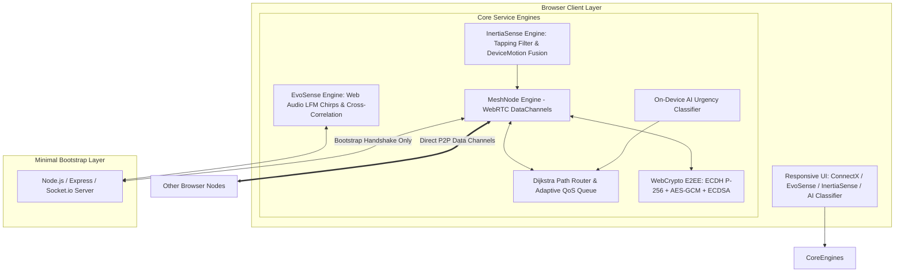

# ⚡ ZoneSync / CrisisLink: Offline Disaster Mesh & Passive Rescue System

---

## 📖 Executive Summary

**ZoneSync** is a zero-infrastructure, serverless-resilient disaster response web application designed for emergency crisis zones where cellular towers, internet backbones, power grids, and GPS are compromised or completely offline.

By turning everyday smartphones and laptops into an ad-hoc **WebRTC Peer-to-Peer (P2P) Mesh Network**, ZoneSync provides encrypted multi-hop emergency communication, on-device AI urgency classification, passive unconscious victim detection (**InertiaSense**), and ultrasonic acoustic indoor positioning (**EvoSense**) when GPS is blocked by concrete rubble.

---

## 🌟 Features of the Web App

### 1. 🌐 ConnectX — Decentralized P2P Mesh Network
- **Pure Browser-to-Browser Multi-Hop Routing**: Operates over WebRTC DataChannels. Once peers connect, messages hop directly through browser nodes without traveling through an intermediate database or centralized message broker.
- **Dynamic Topology & Live Dijkstra Pathfinding**: Real-time interactive 2D canvas showing active mesh links, hop latencies (RTT), and live animated packet delivery hops.
- **Adaptive QoS & Congestion Avoidance**: Monitors link latency trends (RTT rate-of-change) to predict congestion and prioritize emergency packets over normal traffic.
- **Voice & Image Media Dispatch**: Send synthetic voice dispatches, audio voice notes, and compressed scene photos across the multi-hop mesh.
- **End-to-End Encryption (E2EE) & Authentication**: WebCrypto ECDH (P-256) key exchange + AES-GCM-256 payload encryption + ECDSA (SHA-256) cryptographic signatures to prevent man-in-the-middle tampering.
- **Live GPS & Emergency Beacon Integration**: Broadcast live location coordinates with instant Google Maps pins to all mesh nodes.

---

### 2. 📡 EvoSense — Acoustic Indoor Positioning Radar
- **GPS-Free Indoor Localization**: Uses ultrasonic Linear Frequency Modulation (LFM) acoustic chirps (17 kHz – 19 kHz) played through speakers and captured by microphones.
- **Time-of-Flight (ToF) & Round-Trip-Time (RTT) Ranging**: Calculates millimeter/centimeter-accurate pairwise acoustic distances ($d = \frac{v \cdot \text{RTT}}{2}$) using matched-filter cross-correlation.
- **2D/3D Multi-Lateration Solver**: Solves relative spatial coordinates via iterative least-squares optimization.
- **3D Spatial Canvas Radar**: Visualizes survivor positions, elevation columns, drop shadows, and distance vectors with a smooth 3D auto-orbiting view.
- **Simulation Mode**: Built-in ⚡ multi-floor 3D simulation for instant demonstration on single devices or non-HTTPS testing environments.

---

### 3. ⚡ InertiaSense — AI Passive Victim Detection
- **Zero-Touch Survivor Detection**: Designed for unconscious, trapped, or immobilized survivors who cannot physically operate a phone.
- **Dual-Sensor Fusion (Audio + Motion)**:
  - **Acoustic Tapping Detector**: Web Audio API processes acoustic frequencies (2–4 Hz cadence) to detect rhythmic debris tapping or distress knocking.
  - **Inertia & Stillness Monitoring**: DeviceMotion accelerometer tracks prolonged immobility following an acoustic cue or impact event.
- **Auto-Beacon Transmission**: Automatically broadcasts an emergency survivor packet (with live location coordinates, confidence level, and classified environment) across the ConnectX mesh to rescue teams.
- **False Alarm Prevention**: Inertia alarms only activate when an acoustic cue / vibration is detected first, preventing alarms on sleeping or stationary resting devices.

---

### 4. 🧠 AI Urgency Classifier & Dynamic Model Manager
- **On-Device NLP Urgency Scoring**: Instant heuristic & NLP token analysis scoring message urgency from 0 to 10 (**Critical**, **Elevated**, **Normal**).
- **Interactive Live Tester**: Test any emergency sentence in real-time to preview priority output and triggered keyword weights.
- **Hot Model Weight Distribution**: Add emergency keywords and deploy updated weights across the entire mesh network in real time.

---

### 5. 🔄 Universal Cross-Mode Synchronization
- **Background Mesh Connectivity**: When a user connects to **EvoSense** or **InertiaSense**, their device automatically registers and maintains an active connection in the **ConnectX** P2P mesh network.
- **Persistent Identity**: Session and node identities are retained across page reloads and mode switches without generating duplicate ghost nodes.

---

## ⚙️ How It Works (Step-by-Step)

```
[ Device A (Survivor) ]                     [ Device B (Relay Node) ]                  [ Device C (Rescue Base) ]
         │                                              │                                           │
         ├────── (1) WebRTC DataChannel (Direct) ───────┼────── (1) WebRTC DataChannel (Direct) ────┤
         │                                              │                                           │
  [InertiaSense /                                       │                                           │
   ConnectX]                                            │                                           │
         │ (2) Tapping/Immobility detected              │                                           │
         │     or Message composed                      │                                           │
         │                                              │                                           │
         ├────── (3) E2EE Encrypted Envelope ──────────►│                                           │
         │       (Highest QoS Priority)                 ├────── (4) Forwarded across Hop 2 ────────►│
         │                                              │                                    [ConnectX Log]
         │                                              │                                  📍 5-Star Alert
         │                                              │                                  📍 Live GPS Map Pin
```

1. **Bootstrap / Introduction**:
   - Devices open the web app. The lightweight Node.js signaling server relays initial WebRTC handshake offers, answers, and ICE candidates between browser tabs or phones on the same local Wi-Fi/hotspot.
   - Once connected, the signaling server is no longer in the data path.
2. **Topology Discovery (Link-State Flooding)**:
   - Each browser periodically pings its directly connected peers, measures Round-Trip Time (RTT), and floods its local neighborhood topology.
   - Every node independently derives the complete mesh graph and computes the shortest routing path using **Dijkstra's Algorithm**.
3. **Emergency Transmission**:
   - The sender classifies message urgency with the on-device AI.
   - If security is supported, the message and GPS coordinates are encrypted with AES-GCM and signed with ECDSA.
   - The packet hops from peer to peer along the shortest path until delivered to the destination.
4. **Passive Detection & Acoustic Localization**:
   - If trapped under rubble, InertiaSense detects structural tapping or prolonged immobility and broadcasts the SOS beacon across the mesh automatically.
   - EvoSense chirps ultrasonic pulses between nearby phones to compute relative indoor 2D/3D coordinates when satellite GPS is unavailable.

---

## 🏛️ System Architecture



---

## 🎤 How to Present This to the Judges

### 1. ⏱️ The 30-Second Hook
> *"When there is no connectivity and no internet like when earthquake or war happens or a building collapses , when we are oon the hike and in the remote area ,the first things to go down are cellular towers, power, and internet. Victims are trapped under concrete where GPS cannot reach. Also the emergency calls and messages are not going through .How do rescue teams coordinate and locate survivors when all infrastructure is dead?*

> *We built **ZoneSync**: an offline, zero-installation P2P mesh network running directly in the browser with ultrasonic acoustic positioning and passive unconscious victim detection."*

---

### 2. 📱 The 3-Minute Live Demo Walkthrough

1. **Step 1: P2P Multi-Hop Mesh (ConnectX)**
   - Open two browser windows (or one laptop and one smartphone).
   - Enter names (`Rescue Alpha` and `Survivor Phone`).
   - Show the live visual topology graph with the direct link and RTT latency.
   - Send an emergency message: *"Building collapse with trapped survivors!"*
   - Highlight:
     - The **AI Urgency Classifier** instantly flags it as **CRITICAL (Score: 10/10)**.
     - The packet animation hops smoothly across the mesh with **End-to-End Encryption** and **Live GPS location**.

2. **Step 2: Passive Survivor Detection (InertiaSense)**
   - Switch to **InertiaSense** tab on the Survivor device.
   - Click **"⚡ Simulate Tapping Event"** or **"⚡ Simulate Immobility Event"**.
   - Show that within seconds, without the survivor having to type or send anything, an **Emergency Survivor Beacon** is automatically triggered.
   - Switch to the Rescue Base screen: show that the emergency survivor beacon with GPS coordinates appeared in the ConnectX network log with an instant Google Maps link.

3. **Step 3: Acoustic Indoor Localization (EvoSense)**
   - Switch to **EvoSense** tab.
   - Click **"⚡ Simulate 3D Multi-Floor Plot"**.
   - Show the 3D spatial radar canvas with concentric metric rings, elevation tether columns, and pairwise distance vectors.
   - Explain how EvoSense uses ultrasonic audio chirps (17–19 kHz) and multilateration to locate people across multiple floors when satellite GPS is blocked by concrete ceilings.

4. **Step 4: AI Urgency Classifier & Model Manager**
   - Switch to **AI Classifier** tab.
   - Type a custom message in the interactive playground to demonstrate instant NLP classification.
   - Add a custom crisis term (e.g. `landslide` with weight 9) and deploy it to demonstrate hot model updating across the mesh.

---

### 3. 🏆 Key WOW Factors to Emphasize to Judges

| WOW Factor | Why It Stands Out |
| :--- | :--- |
| **No App Store / Zero Install** | Runs immediately in any standard mobile or desktop web browser. |
| **Serverless Data Path** | Kill the backend server mid-demo and already-connected browser nodes continue communicating peer-to-peer! |
| **Acoustic Ranging (EvoSense)** | Solves the indoor GPS dead-zone problem using only built-in speakers and microphones. |
| **Passive Victim Rescue (InertiaSense)** | Saves unconscious or trapped victims who cannot move their hands to unlock a phone. |
| **Military-Grade E2EE** | Uses hardware-accelerated WebCrypto ECDH + AES-GCM, preventing spoofing in chaotic crisis zones. |

---

## 🛠️ What Was Used to Build This & Why

### 1. Architectural Choices & Rationale

- **Why WebRTC DataChannels over Centralized Server WebSockets?**
  - In a real disaster, central cloud servers are inaccessible. WebSockets require an ongoing central server connection. WebRTC DataChannels establish direct peer-to-peer UDP/SCTP connections between devices. Once established, devices communicate even if the internet is completely severed.

- **Why Web Audio API (LFM Chirps) over Bluetooth RSSI / Wi-Fi RTT?**
  - Bluetooth RSSI fluctuates wildly through walls and human bodies (attenuation error up to 300%). Acoustic waves travel at ~343 m/s (approx. 1 million times slower than radio waves), making time-of-flight acoustic ranging millimeter-accurate on standard smartphone hardware.

- **Why WebCrypto API over External JS Crypto Libraries?**
  - External JS cryptography libraries add bundle overhead and are vulnerable to timing attacks. The native browser `window.crypto.subtle` API runs in compiled browser C++ internals with hardware acceleration.

- **Why Pure Vanilla CSS + Canvas 2D/3D Projection over Heavy 3D Libraries (Three.js)?**
  - Disaster devices might be low-power smartphones with low battery. Pure HTML5 Canvas 2D matrix projection delivers 60fps 3D radar visualization with zero Three.js bundle weight and minimal CPU/GPU battery consumption.

---

## 💻 Detailed Technologies Used

### Frontend Stack
- **Framework**: React 19 (Functional components, custom hooks, reactive state).
- **Build Tool**: Vite 8 (Ultra-fast HMR, optimized production rollup).
- **Styling**: Vanilla CSS Design System with dark mode, glassmorphism, responsive grid layouts, and touch-target optimization.
- **Routing**: React Router DOM v7.
- **Real-Time Client**: Socket.io Client v4.8 (signaling handshake).

### Native Web APIs Utilized
- **WebRTC API (`RTCPeerConnection`, `RTCDataChannel`)**: P2P data transport, ICE negotiation, STUN candidate routing.
- **Web Audio API (`AudioContext`, `createScriptProcessor`, `createBufferSource`, `AnalyserNode`)**: Ultrasonic chirp signal synthesis, matched-filter cross-correlation, acoustic peak detection.
- **DeviceMotion API (`DeviceMotionEvent`)**: Accelerometer variance and immobility tracking.
- **WebCrypto API (`crypto.subtle`)**: ECDH P-256 key agreement, AES-GCM 256-bit symmetric encryption, ECDSA SHA-256 digital signatures.
- **Geolocation API (`navigator.geolocation`)**: Live GPS positioning with accuracy radius tracking.

### Backend Infrastructure
- **Runtime**: Node.js.
- **Framework**: Express.js (serving production builds and REST endpoints).
- **Signaling Engine**: Socket.io Server (ephemeral peer introduction and WebRTC signaling exchange).

### Mathematical & Algorithmic Foundations
- **Dijkstra's Algorithm**: Dynamic multi-hop shortest path calculation across the P2P mesh graph.
- **Linear Frequency Modulation (LFM) with Tukey Windowing**: Chirp waveform generation for high signal-to-noise ratio acoustic ranging.
- **Time-Domain Cross-Correlation**: Matched filtering for sub-millisecond audio arrival time detection.
- **Iterative Least-Squares Multilateration (Gradient Descent)**: Solves relative 2D coordinates from pairwise distance matrices.
- **Moving-Average Latency Trend Prediction**: Congestion forecasting and QoS packet queuing.

---

## 📊 Summary of Project Modules

| Module | Core Responsibility | Key Technologies |
| :--- | :--- | :--- |
| **🌐 ConnectX** | Multi-hop P2P mesh network, live topology visualization, encrypted text, voice and photo transmission | WebRTC, Dijkstra Routing, WebCrypto E2EE |
| **📡 EvoSense** | Acoustic indoor positioning radar, time-of-flight ranging, 3D multi-lateration | Web Audio API, Ultrasonic LFM, Canvas Projection |
| **⚡ InertiaSense** | Passive acoustic tapping & stillness detection, auto-beacon GPS broadcasting | DeviceMotion, Audio Filtering, Sensor Fusion |
| **🧠 AI Classifier** | Disaster urgency keyword scoring, dynamic model distribution, live test playground | NLP Heuristic Tokenizer, WebSockets |
